# Manual do Proprietário — Mercado Araujo Hub
**Sistema de Automação de Atendimento via WhatsApp**

---

## Sumário

1. [Visão Geral do Sistema](#1-visão-geral-do-sistema)
2. [Como Acessar o Hub](#2-como-acessar-o-hub)
3. [Papéis de Usuário](#3-papéis-de-usuário)
4. [Módulos do Hub](#4-módulos-do-hub)
   - 4.1 [Kanban — Acompanhamento em Tempo Real](#41-kanban--acompanhamento-em-tempo-real)
   - 4.2 [Pedidos](#42-pedidos)
   - 4.3 [Clientes](#43-clientes)
   - 4.4 [CRM — Dashboard Analítico](#44-crm--dashboard-analítico)
   - 4.5 [Ofertas e Kits](#45-ofertas-e-kits)
   - 4.6 [Preços e Catálogo](#46-preços-e-catálogo)
5. [Automação via WhatsApp — Como funciona](#5-automação-via-whatsapp--como-funciona)
   - 5.1 [Fluxo completo de uma venda](#51-fluxo-completo-de-uma-venda)
   - 5.2 [Handoff para atendente humano](#52-handoff-para-atendente-humano)
   - 5.3 [Follow-up automático](#53-follow-up-automático)
   - 5.4 [Atualização de preço via WhatsApp](#54-atualização-de-preço-via-whatsapp)
6. [Configurações do Sistema](#6-configurações-do-sistema)
   - 6.1 [Gerenciar Usuários do Hub](#61-gerenciar-usuários-do-hub)
   - 6.2 [Funcionários Autorizados](#62-funcionários-autorizados)
   - 6.3 [Follow-up — Configuração](#63-follow-up--configuração)
7. [Etapas do Cliente — Ciclo de Vida](#7-etapas-do-cliente--ciclo-de-vida)
8. [Notificações Automáticas ao Cliente](#8-notificações-automáticas-ao-cliente)
9. [Pontos de Atenção Críticos](#9-pontos-de-atenção-críticos)
10. [Serviços e Dependências Externas](#10-serviços-e-dependências-externas)
11. [O que fazer quando algo não funciona](#11-o-que-fazer-quando-algo-não-funciona)

---

## 1. Visão Geral do Sistema

O **Araujo Hub** é um sistema completo de automação de atendimento para o Mercado Araujo. Ele integra três camadas:

| Camada | O que é | Para quê serve |
|--------|---------|---------------|
| **Hub (site)** | Painel web do operador | Visualizar pedidos, clientes, aprovar preços, acompanhar Kanban |
| **IA via WhatsApp** | Agente automático no número da loja | Atender clientes, tirar dúvidas, fechar pedidos automaticamente |
| **N8n (automação)** | Motor de fluxos nos bastidores | Orquestra a IA, gera resumos, envia notificações, dispara follow-ups |

### Como as três camadas se conectam:

```
┌─────────────────────────────────────────────────────────────────┐
│                        CLIENTE                                  │
│              (WhatsApp no celular)                              │
└──────────────────────────┬──────────────────────────────────────┘
                           │ mensagem
                           ▼
┌─────────────────────────────────────────────────────────────────┐
│                   EVOLUTION API                                 │
│           (ponte entre WhatsApp e o sistema)                    │
└──────────────────────────┬──────────────────────────────────────┘
                           │ webhook
                           ▼
┌─────────────────────────────────────────────────────────────────┐
│                       N8N                                       │
│   Fluxo 1: identifica intenção (compra, dúvida, handoff...)     │
│   Fluxo 2: fecha pedido (itens, endereço, pagamento)            │
│   Fluxo 7: notifica cliente a cada etapa                        │
│   Fluxo 13: gera resumo automático do atendimento               │
└──────────┬───────────────────────────────────┬──────────────────┘
           │ salva dados                        │ notifica
           ▼                                    ▼
┌──────────────────────┐            ┌──────────────────────────┐
│      SUPABASE        │            │       ARAUJO HUB         │
│  (banco de dados)    │◄──────────►│   (painel do operador)   │
│  clientes, pedidos,  │            │  Kanban, Pedidos,        │
│  histórico, config   │            │  Clientes, CRM, Preços   │
└──────────────────────┘            └──────────────────────────┘
```

### O fluxo básico de uma venda:

```
1. Cliente manda mensagem no WhatsApp da loja
         ↓
2. IA responde automaticamente (identifica o que o cliente quer)
         ↓
3. Se for pedido → IA coleta itens, endereço e forma de pagamento
         ↓
4. Pedido aparece no Hub para o operador acompanhar
         ↓
5. Operador avança as etapas: Separação → Em Rota → Entregue
         ↓
6. Cliente recebe notificação automática no WhatsApp a cada etapa
```

---

## 2. Como Acessar o Hub

**Endereço:** `https://araujo-hub.vercel.app`

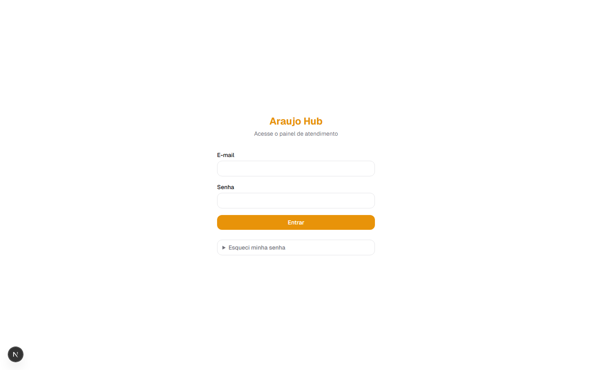

> **O que você vê na tela acima:**
> - Campo **E-mail** — digite o e-mail cadastrado pelo administrador
> - Campo **Senha** — digite sua senha
> - Botão laranja **"Entrar"** — clique para acessar
> - Link **"Esqueci minha senha"** — clique para receber um link de redefinição por e-mail

> **Atenção:** O link de redefinição de senha expira em 24 horas. Se expirar, clique novamente em "Esqueci minha senha" para gerar um novo.

---

## 3. Papéis de Usuário

O sistema possui dois perfis de acesso:

| Perfil | O que pode fazer |
|--------|----------------|
| **Admin** | Tudo: CRM, pedidos, clientes, kanban, preços, aprovação, configurações, convite de usuários |
| **Atendimento** | CRM, pedidos, clientes e kanban — sem acesso a configurações e aprovação de preços |

O perfil do usuário logado aparece **no canto superior direito** do Hub (ao lado do nome). No exemplo das telas deste manual, o usuário logado é **Admin**.

---

## 4. Módulos do Hub

### 4.1 Kanban — Acompanhamento em Tempo Real

O Kanban é a **tela principal de operação**. Acesse pelo menu lateral esquerdo clicando em **"Kanban"**.

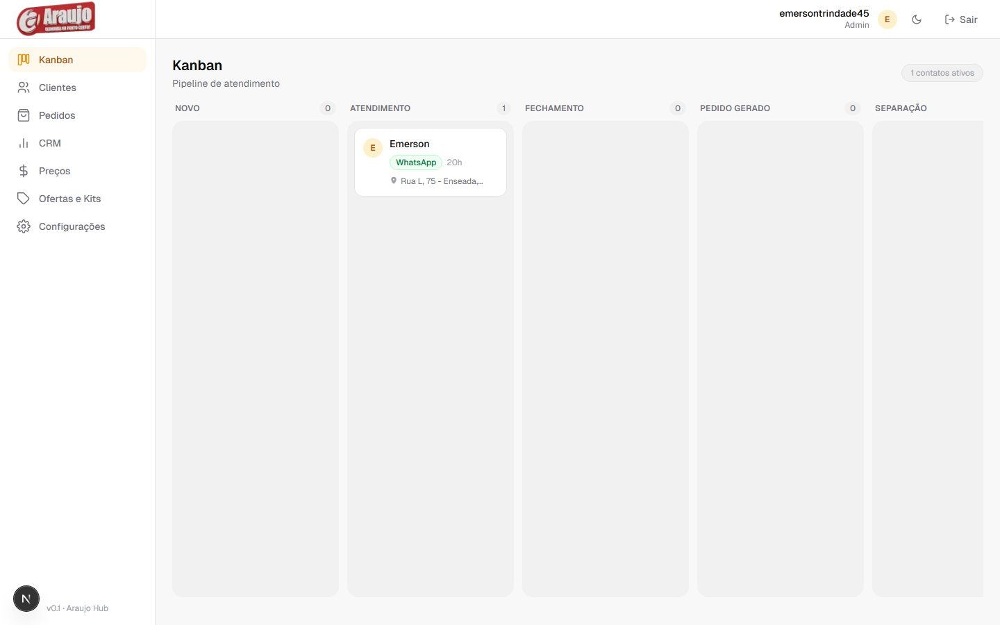

> **O que você vê na tela acima:**
> - **Menu lateral esquerdo** — navegação entre todos os módulos (Kanban, Clientes, Pedidos, CRM, Preços, Ofertas e Kits, Configurações)
> - **Logo Araujo** no canto superior esquerdo
> - **Colunas horizontais** — cada coluna é uma etapa do atendimento (NOVO, ATENDIMENTO, FECHAMENTO, PEDIDO GERADO, SEPARAÇÃO...)
> - **Número em cinza** ao lado do nome da coluna — quantidade de clientes naquela etapa
> - **Card do cliente** — aparece na coluna da etapa atual. Mostra nome, canal de origem (WhatsApp), tempo desde o último contato e endereço
> - **"1 contatos ativos"** no canto superior direito — total de clientes no funil
> - **Nome e papel do usuário** (ex: "emersontrindade45 / Admin") no topo direito
> - **Ícone de lua** — alterna entre modo claro e escuro
> - **"Sair"** — encerra a sessão

**O Kanban atualiza automaticamente** — não precisa recarregar a página quando um novo pedido chega ou uma etapa é avançada.

#### Painel lateral do card

Ao **clicar em um card de cliente**, abre um painel lateral com:
- Dados do cliente (nome, telefone, canal de origem)
- **Resumo do último atendimento** — gerado automaticamente pela IA ao final de cada conversa
- Histórico de pedidos do cliente
- Botão **"Fazer Handoff para Atendente"** — pausa a IA e aciona o atendimento humano (veja seção 5.2)
- Botão para **avançar a etapa** do cliente

---

### 4.2 Pedidos

Acesse pelo menu lateral esquerdo clicando em **"Pedidos"**.

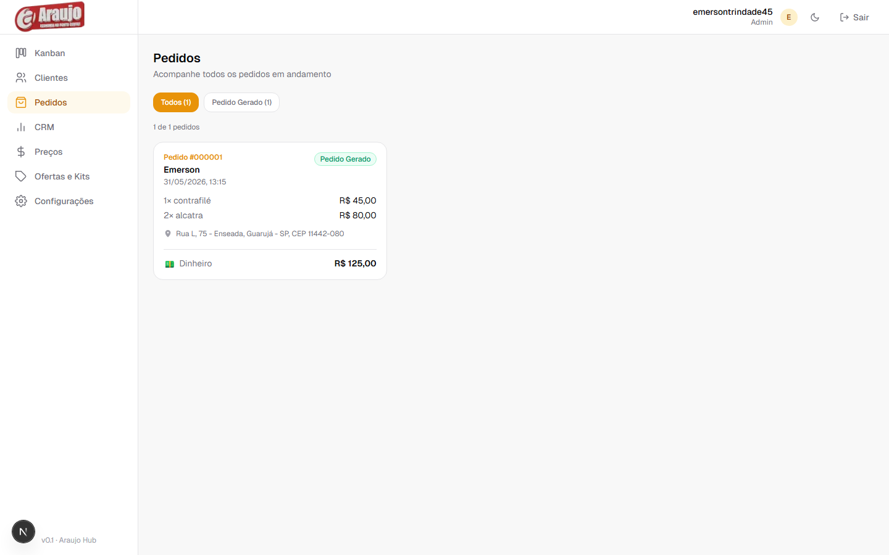

> **O que você vê na tela acima:**
> - **Filtros por status** no topo — "Todos" e abas por status (ex: "Pedido Gerado (1)"). Clique na aba para filtrar
> - **Contador** — "1 de 1 pedidos" mostra quantos pedidos existem
> - **Card do pedido** com:
>   - Número do pedido (ex: **Pedido #000001**) em laranja — clique para abrir os detalhes
>   - Badge com o **status atual** (ex: "Pedido Gerado") no canto direito do card
>   - **Nome do cliente** e data/hora do pedido
>   - **Itens do pedido** com quantidade e valor (ex: 1× contrafilé R$45,00 / 2× alcatra R$80,00)
>   - **Endereço de entrega** com ícone de localização
>   - **Forma de pagamento** (ex: Dinheiro) e **valor total** (ex: R$125,00)

#### Detalhes do pedido

Clique no número do pedido (em laranja) para abrir a tela de detalhes completos:

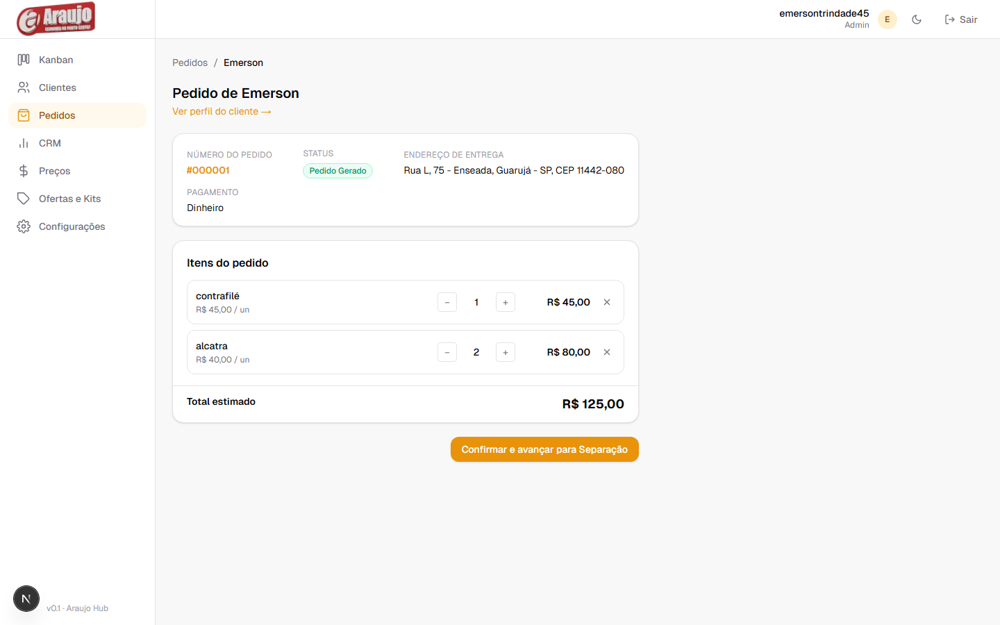

> **O que você vê na tela acima:**
> - **Breadcrumb** no topo: "Pedidos / Emerson" — clique em "Pedidos" para voltar à lista
> - **Link "Ver perfil do cliente →"** (laranja) — abre a página de detalhe do cliente
> - **Card de cabeçalho** com: Número do pedido (#000001), Status atual (badge "Pedido Gerado"), Endereço de entrega completo, Forma de pagamento
> - **Seção "Itens do pedido"** — lista cada item com: nome, preço unitário, botões **"−"** e **"+"** para ajustar quantidade, botão **"×"** para remover o item, e valor subtotal
> - **Total estimado** calculado automaticamente
> - **Botão laranja "Confirmar e avançar para Separação"** — confirma o pedido, atualiza o Kanban e envia notificação automática ao cliente no WhatsApp

> **Importante:** Ao avançar o pedido pela página de Pedidos, o Kanban também é atualizado automaticamente em tempo real.

---

### 4.3 Clientes

Acesse pelo menu lateral esquerdo clicando em **"Clientes"**.

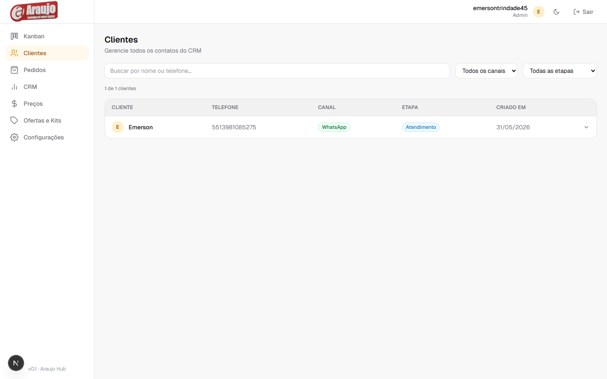

> **O que você vê na tela acima:**
> - **Campo de busca** no topo — pesquise por nome ou telefone do cliente
> - **Filtro "Todos os canais"** — filtre por WhatsApp, Instagram ou Landpage
> - **Filtro "Todas as etapas"** — filtre por etapa atual do cliente no funil
> - **Contador** — "1 de 1 clientes"
> - **Tabela de clientes** com colunas: CLIENTE (nome + avatar), TELEFONE, CANAL (badge colorido: WhatsApp em verde, Instagram em roxo), ETAPA (badge com a etapa atual), CRIADO EM

#### Página de detalhe do cliente

Clique na linha do cliente na tabela para abrir a página completa de detalhe:

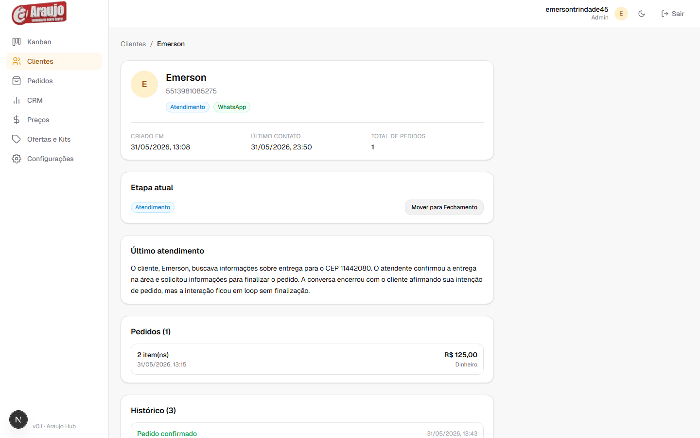

> **O que você vê na tela acima:**
> - **Breadcrumb** no topo: "Clientes / Emerson"
> - **Card de cabeçalho**: avatar com inicial do nome, nome completo, telefone, badges de etapa atual (Atendimento) e canal (WhatsApp), data de criação, data do último contato, total de pedidos
> - **Card "Etapa atual"**: mostra a etapa em que o cliente está e o botão **"Mover para [próxima etapa]"** — ao clicar, move o cliente e envia notificação automática no WhatsApp
> - **Card "Último atendimento"**: resumo gerado automaticamente pela IA ao final da última conversa. Texto em laranja indica palavras-chave da conversa
> - **Card "Pedidos"**: lista os pedidos do cliente com quantidade de itens, data, total e forma de pagamento — clique para abrir o detalhe do pedido
> - **Card "Histórico"**: registro das movimentações de etapa (ex: "Pedido confirmado", "Em rota") com data e hora

---

### 4.4 CRM — Dashboard Analítico

Acesse pelo menu lateral esquerdo clicando em **"CRM"**.

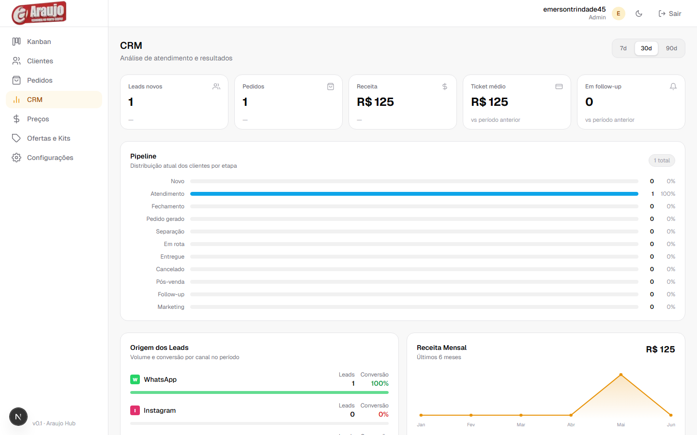

> **O que você vê na tela acima:**
> - **Seletor de período** no canto superior direito: **7d**, **30d**, **90d** — clique para mudar o período analisado
> - **5 cards de KPI** no topo:
>   - **Leads novos** — clientes que entraram no período
>   - **Pedidos** — pedidos gerados no período
>   - **Receita** — valor total dos pedidos
>   - **Ticket médio** — valor médio por pedido
>   - **Em follow-up** — clientes aguardando reengajamento
> - **Pipeline** — barras horizontais mostrando quantos clientes estão em cada etapa. A barra azul indica a etapa com mais clientes
> - **Origem dos Leads** — de onde vieram os clientes (WhatsApp, Instagram, Landpage) com taxa de conversão
> - **Receita Mensal** — gráfico de linha com a receita dos últimos 6 meses

Rolando a página para baixo, você encontra também: Top Produtos mais vendidos, Retenção de clientes e estatísticas de Automação (handoffs, follow-ups, taxa de automação da IA).

---

### 4.5 Ofertas e Kits

Acesse pelo menu lateral esquerdo clicando em **"Ofertas e Kits"**.

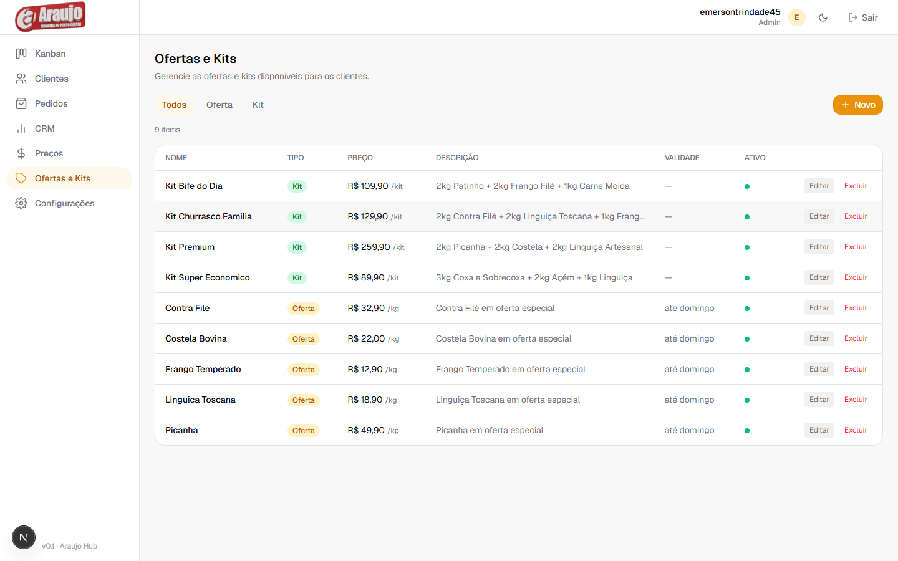

> **O que você vê na tela acima:**
> - **Abas de filtro** no topo: "Todos", "Oferta", "Kit" — clique para filtrar por tipo
> - **Botão "+ Novo"** (laranja, canto superior direito) — clique para criar uma nova oferta ou kit
> - **Contador** — "9 items"
> - **Tabela** com colunas: NOME, TIPO (badge "Kit" em azul ou "Oferta" em laranja), PREÇO (com unidade: /kit ou /kg), DESCRIÇÃO, VALIDADE, ATIVO (ponto verde = ativo)
> - **Botões "Editar"** e **"Excluir"** em cada linha — para modificar ou remover o item

> A IA usa essas informações quando o cliente pergunta "Tem alguma oferta?" ou "Quais são os kits disponíveis?". **Mantenha sempre atualizado** com as promoções da semana.

**Para criar uma nova oferta ou kit:** clique em **"+ Novo"**, preencha nome, tipo, preço, descrição e validade, e salve.

**Para desativar temporariamente** (sem excluir): clique em "Editar" e desmarque o campo "Ativo".

---

### 4.6 Preços e Catálogo

Acesse pelo menu lateral esquerdo clicando em **"Preços"**.

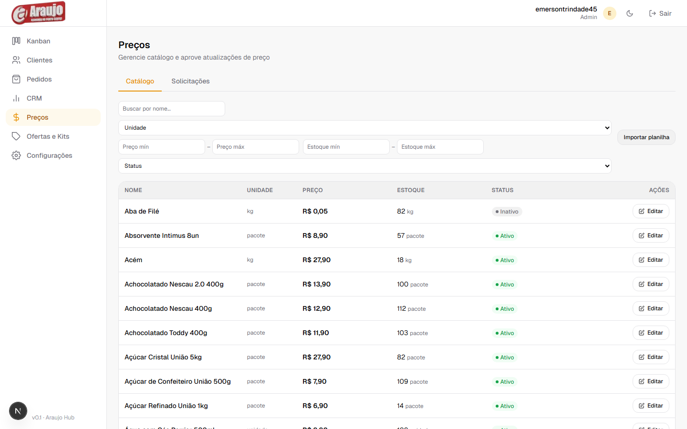

> **O que você vê na tela acima:**
> - **Abas** no topo: **"Catálogo"** (selecionada, em laranja) e **"Solicitações"**
> - **Campo de busca** — pesquise produto por nome
> - **Filtros avançados**: Unidade, Preço mín/máx, Estoque mín/máx, Status
> - **Botão "Importar planilha"** (canto superior direito) — para importar produtos em lote via CSV ou Excel
> - **Tabela do catálogo** com colunas: NOME, UNIDADE (kg, pacote, etc.), PREÇO, ESTOQUE (quantidade + unidade), STATUS (● Ativo em verde / ● Inativo em cinza), AÇÕES
> - **Botão "Editar"** em cada linha — clique para alterar o preço atual, estoque ou ativar/desativar o produto

#### Aba "Solicitações"

Clique na aba **"Solicitações"** para ver pedidos de alteração de preço enviados via WhatsApp por funcionários autorizados (veja seção 5.4).

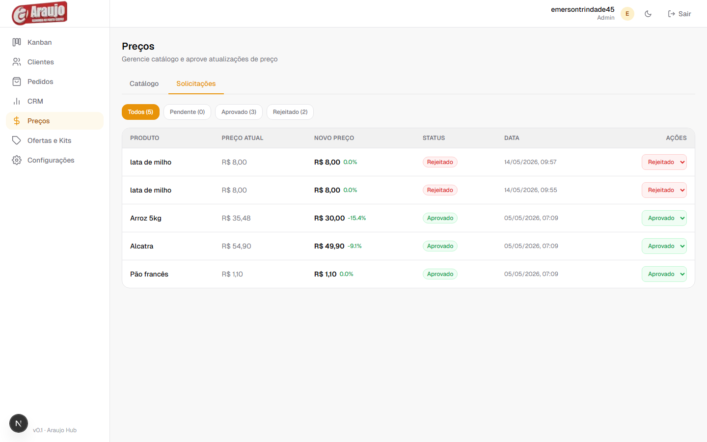

> **O que você vê na tela acima:**
> - **Abas de filtro**: Todos (5), Pendente (0), Aprovado (3), Rejeitado (2) — clique para filtrar por status
> - **Tabela** com colunas: PRODUTO, PREÇO ATUAL, NOVO PREÇO (com variação percentual em verde/vermelho), STATUS (badge colorido), DATA, AÇÕES
> - **Dropdown de ação** em cada linha — permite mudar o status para Aprovado ou Rejeitado
> - Somente o **Admin** consegue ver e usar os dropdowns de aprovação

**Regra importante:** A IA busca preços e disponibilidade diretamente neste catálogo. Se um produto estiver com preço errado ou marcado como inativo, a IA dará a informação errada ao cliente. **Mantenha o catálogo sempre atualizado.**

#### Como importar produtos em lote

1. Clique em **"Importar planilha"**
2. Envie um arquivo CSV ou Excel com os produtos
3. O sistema atualiza automaticamente — se o produto já existe pelo nome, o preço é atualizado; se não existe, é criado

---

## 5. Automação via WhatsApp — Como funciona

O número de WhatsApp da loja está conectado ao sistema. **Toda mensagem recebida é processada automaticamente pela IA**, sem precisar de intervenção humana.

### 5.1 Fluxo completo de uma venda

```
┌──────────────────────────────────────────────────────────────┐
│  CLIENTE envia mensagem no WhatsApp                          │
└─────────────────────────┬────────────────────────────────────┘
                          │
              ┌───────────▼───────────┐
              │   Cliente novo?       │
              │   IA pede o nome      │
              │   antes de continuar  │
              └───────────┬───────────┘
                          │ nome informado
                          ▼
              ┌───────────────────────┐
              │  IA identifica        │
              │  a INTENÇÃO           │
              └───────────┬───────────┘
                          │
        ┌─────────────────┼──────────────────────┐
        ▼                 ▼                       ▼
  ┌──────────┐     ┌──────────────┐      ┌─────────────┐
  │  Dúvida  │     │ Busca produto│      │   Pedido    │
  │          │     │              │      │             │
  │ Responde │     │ Busca no     │      │ Coleta      │
  │ via base │     │ catálogo e   │      │ itens →     │
  │ de       │     │ retorna      │      │ endereço →  │
  │ conhecim.│     │ preço e      │      │ pagamento → │
  └──────────┘     │ disponib.    │      │ gera pedido │
                   └──────────────┘      └──────┬──────┘
                                                │
                                    ┌───────────▼──────────┐
                                    │  Pedido aparece       │
                                    │  no HUB para o        │
                                    │  operador             │
                                    └───────────┬───────────┘
                                                │ operador avança etapa
                                                ▼
                                    ┌───────────────────────┐
                                    │  Cliente recebe        │
                                    │  notificação automática│
                                    │  no WhatsApp           │
                                    └───────────────────────┘
```

**Tipos de intenção que a IA reconhece:**

| O cliente diz... | IA faz... |
|-----------------|-----------|
| "Qual o preço da picanha?" | Busca no catálogo e responde com preço e estoque |
| "Tem oferta hoje?" | Lista as ofertas e kits cadastrados |
| "Vocês entregam no bairro X?" | Busca na base de conhecimento da loja |
| "Quero fazer um pedido" | Inicia o fluxo de fechamento (coleta itens, endereço, pagamento) |
| "Qual o status do meu pedido?" | Retorna o status atual e itens do pedido |
| "Quero falar com um atendente" | Faz handoff automático para humano |

---

### 5.2 Handoff para atendente humano

Quando a conversa precisa de um atendente humano, o sistema faz o **handoff** — pausa a IA e avisa a equipe.

```
┌─────────────────────────────────────────────────────┐
│              HANDOFF — duas formas                   │
├─────────────────────┬───────────────────────────────┤
│   AUTOMÁTICO (IA)   │       MANUAL (Hub)             │
│                     │                                │
│ IA não sabe         │ Operador clica                 │
│ responder ou        │ "Fazer Handoff para            │
│ cliente pede        │  Atendente" no painel          │
│ atendente           │  lateral do Kanban             │
└──────────┬──────────┴────────────┬───────────────────┘
           │                       │
           └──────────┬────────────┘
                      ▼
         IA é PAUSADA (atendimento_ia = pausa)
                      │
          ┌───────────┴────────────┐
          ▼                        ▼
  Cliente recebe           Grupo de atendimento
  mensagem no              no WhatsApp recebe
  WhatsApp:                RESUMO automático
  "Um atendente            da conversa
  irá continuar"           (gerado pela IA)
```

> **Após o handoff:** O operador deve atender o cliente **diretamente pelo celular ou WhatsApp Web**, usando o mesmo número da loja. A IA não responde mais até ser reativada.

> **Atenção crítica:** Se ninguém atender após o handoff, o cliente ficará sem resposta. Tenha sempre um responsável de plantão para os handoffs.

---

### 5.3 Follow-up automático

O sistema envia mensagens automáticas para clientes que ficaram sem resposta por vários dias.

```
Cliente em etapa "follow_up"
          │
          │ fica X dias sem resposta
          ▼
Sistema envia mensagem automática no WhatsApp
(texto configurável em Configurações → Follow-up)
          │
          │ sem resposta após Y tentativas
          ▼
Cliente é movido para etapa "Marketing"
(base de clientes para campanhas futuras)
```

**Configurar:** Acesse **Configurações → Follow-up automático** (somente Admin) — veja seção 6.3.

---

### 5.4 Atualização de preço via WhatsApp

Funcionários autorizados podem solicitar alteração de preço pelo **próprio WhatsApp da loja**, sem precisar acessar o Hub.

```
Funcionário envia mensagem no WhatsApp da loja
  ex: "Atualizar alcatra para R$45,90"
          │
          ▼
Sistema verifica se o número está
na lista de Funcionários Autorizados
          │
    ┌─────┴──────┐
    │            │
Autorizado    Não autorizado
    │            │
    ▼            ▼
Solicitação   Mensagem ignorada
aparece no Hub
(status: Pendente)
    │
    ▼
Admin aprova ou rejeita
em Preços → Solicitações
    │
Aprovado
    │
    ▼
Preço atualizado automaticamente no catálogo
```

**Cadastrar funcionários autorizados:** Acesse **Configurações → Funcionários autorizados** (somente Admin) — veja seção 6.2.

---

## 6. Configurações do Sistema

Acesse pelo menu lateral esquerdo clicando em **"Configurações"** (somente Admin). O submenu da esquerda mostra as seções disponíveis.

### 6.1 Gerenciar Usuários do Hub

Acesse **Configurações → Usuários e papéis**.

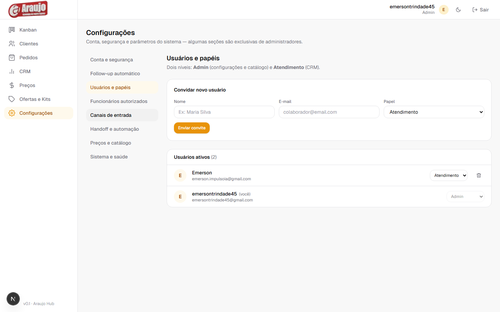

> **O que você vê na tela acima:**
> - **Submenu esquerdo** com todas as seções de configuração: Conta e segurança, Follow-up automático, Usuários e papéis (selecionado), Funcionários autorizados, Canais de entrada, Handoff e automação, Preços e catálogo, Sistema e saúde
> - **Formulário "Convidar novo usuário"** com campos:
>   - **Nome** — nome do novo colaborador
>   - **E-mail** — endereço de e-mail para envio do convite
>   - **Papel** — dropdown com opções: Atendimento ou Admin
>   - **Botão "Enviar convite"** (laranja) — envia o convite por e-mail
> - **Lista "Usuários ativos"** — mostra todos os usuários com e-mail e papel atual
>   - Dropdown de papel em cada linha — para alterar o papel (Admin ↔ Atendimento)
>   - Ícone de lixeira — para remover o usuário
>   - O usuário logado aparece com a tag **(você)** e não pode alterar o próprio papel

**Como convidar um novo usuário:**
1. Preencha o **Nome** e **E-mail** do colaborador
2. Selecione o **Papel**: Atendimento (acesso ao CRM apenas) ou Admin (acesso total)
3. Clique em **"Enviar convite"**
4. O colaborador receberá um e-mail com link para criar a senha

**Como alterar o papel:** Na lista de usuários ativos, clique no dropdown ao lado do nome e selecione o novo papel.

**Como remover um usuário:** Clique no ícone de lixeira ao lado do usuário.

---

### 6.2 Funcionários Autorizados

Acesse **Configurações → Funcionários autorizados**.

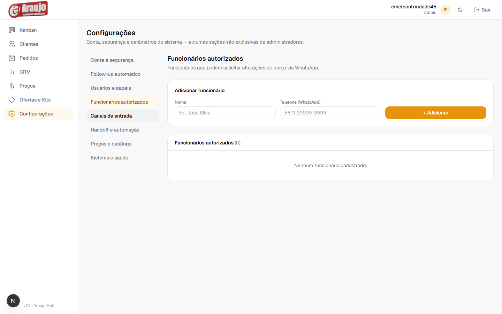

> **O que você vê na tela acima:**
> - **Formulário "Adicionar funcionário"** com campos:
>   - **Nome** — nome do funcionário (ex: João Silva)
>   - **Telefone (WhatsApp)** — número no formato 55 11 99999-9999
>   - **Botão "+ Adicionar"** (laranja) — adiciona o funcionário à lista
> - **Lista "Funcionários autorizados"** — mostra os funcionários cadastrados (neste exemplo, vazia)

> **Atenção:** Apenas os números cadastrados aqui podem solicitar alteração de preço via WhatsApp. Mensagens de números **não autorizados são ignoradas silenciosamente** pelo sistema.

**Como adicionar um funcionário:**
1. Preencha o **Nome** e o **Telefone** (com DDD e código do país: 55)
2. Clique em **"+ Adicionar"**

**Para desativar temporariamente** (sem remover): na lista, use o toggle de ativo/inativo.

---

### 6.3 Follow-up — Configuração

Acesse **Configurações → Follow-up automático**.

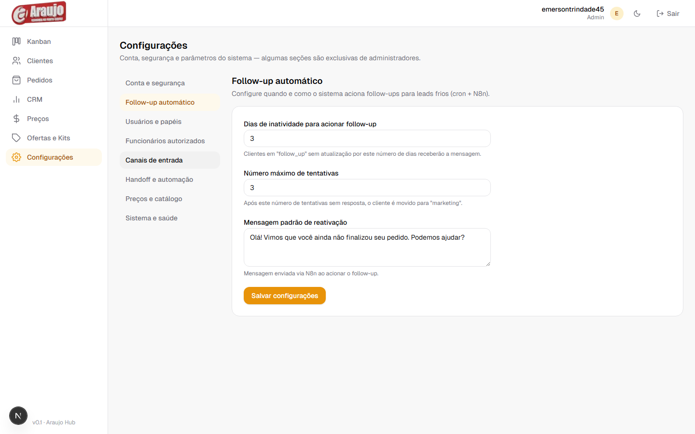

> **O que você vê na tela acima:**
> - **"Dias de inatividade para acionar follow-up"** — campo numérico. Clientes em etapa "follow_up" sem atualização por este número de dias receberão a mensagem automática. Padrão: **3 dias**
> - **"Número máximo de tentativas"** — campo numérico. Após este número de tentativas sem resposta, o cliente é movido para etapa "marketing". Padrão: **3 tentativas**
> - **"Mensagem padrão de reativação"** — texto enviado ao cliente via WhatsApp. Edite conforme quiser. Padrão: *"Olá! Vimos que você ainda não finalizou seu pedido. Podemos ajudar?"*
> - **Botão "Salvar configurações"** (laranja) — salva as alterações

**Como configurar:**

1. Ajuste os campos conforme a estratégia da loja
2. Edite a mensagem de reativação com um texto mais personalizado (pode incluir nome da loja, promoção, etc.)
3. Clique em **"Salvar configurações"**

---

### 6.4 Conta e Segurança

Acesse **Configurações → Conta e segurança**. Disponível para todos os usuários (Admin e Atendimento).

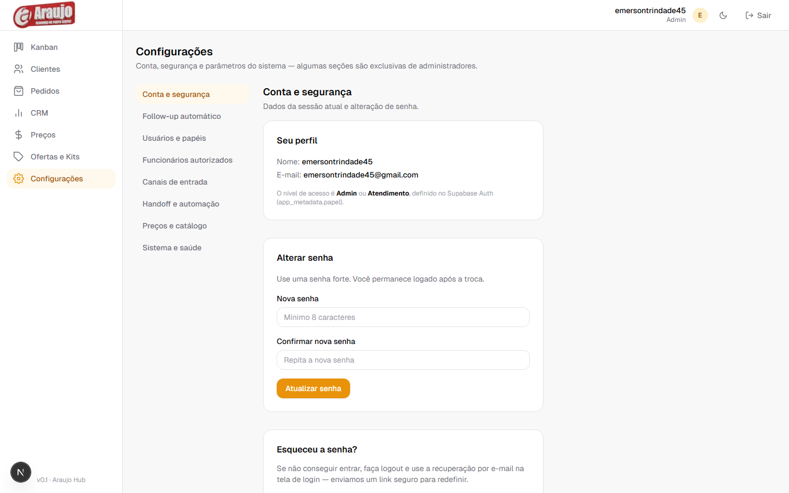

> **O que você vê na tela acima:**
> - **Card "Seu perfil"** — exibe o nome e e-mail do usuário logado. O papel (Admin ou Atendimento) é gerenciado pelo administrador em "Usuários e papéis"
> - **Card "Alterar senha"** — campos "Nova senha" (mínimo 8 caracteres) e "Confirmar nova senha", seguidos do botão **"Atualizar senha"** (laranja). Você permanece logado após a troca
> - **Card "Esqueceu a senha?"** — instrução para usar o link de recuperação na tela de login caso não consiga acessar

#### Como trocar a senha

1. Acesse Configurações → Conta e segurança
2. Preencha "Nova senha" e "Confirmar nova senha"
3. Clique em **"Atualizar senha"**

---

### 6.5 Demais seções de Configurações

As seções abaixo existem no menu de Configurações mas são **informativas** — as configurações técnicas delas ficam no painel do Vercel e nos fluxos do N8n. Consulte o desenvolvedor para alterações nessas áreas.

#### Canais de entrada

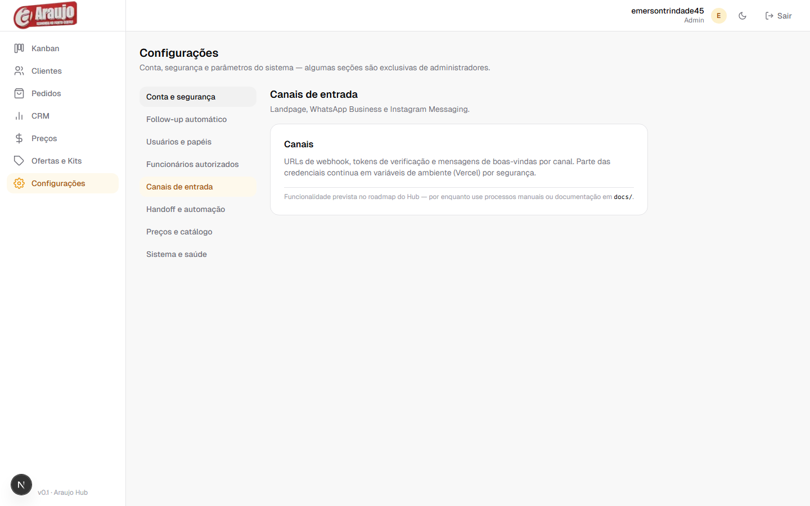

Exibe informações sobre os canais conectados (WhatsApp, Instagram, Landpage). URLs de webhook e tokens de verificação são gerenciados nas variáveis de ambiente do Vercel por segurança.

---

#### Handoff e automação

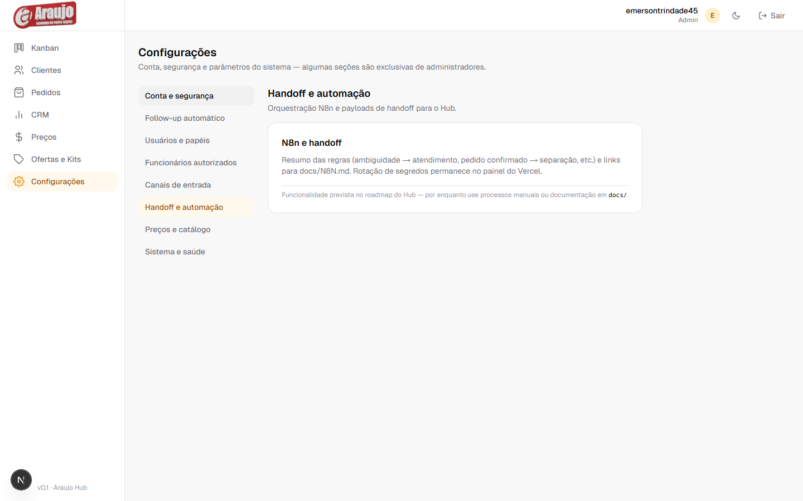

Resume as regras de handoff (ambiguidade → atendimento humano, pedido confirmado → separação, etc.) e os links para a documentação técnica do N8n. Rotação de segredos e chaves é feita no painel do Vercel.

---

#### Preços e catálogo

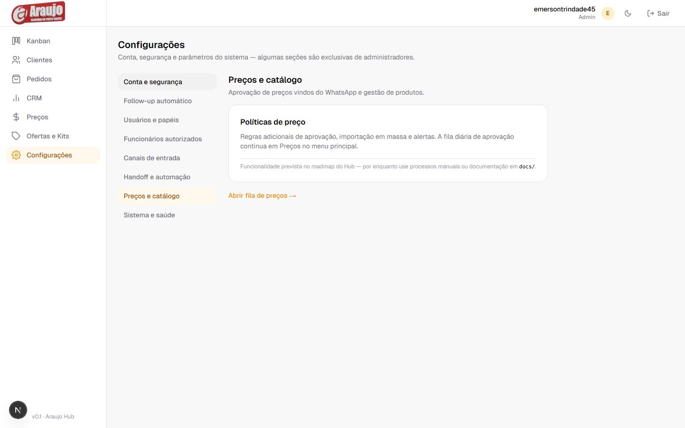

Exibe as políticas de aprovação de preço. A fila de aprovação do dia a dia fica em **Preços → Solicitações** no menu principal. O link **"Abrir fila de preços →"** redireciona diretamente para lá.

---

#### Sistema e saúde

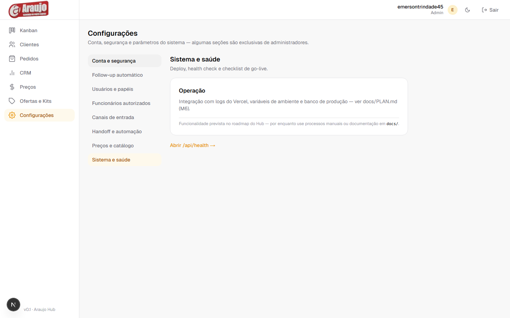

Área técnica de monitoramento. O link **"Abrir /api/health →"** abre o endpoint de health check do Hub — retorna `{"status":"ok"}` se tudo estiver funcionando. Use para verificar rapidamente se o Hub está respondendo.

---

## 7. Etapas do Cliente — Ciclo de Vida

Todo cliente percorre um funil de etapas. Cada coluna do Kanban representa uma etapa.

```
[NOVO] → [ATENDIMENTO] → [FECHAMENTO] → [PEDIDO GERADO]
                                               │
                                               ▼
                                         [SEPARAÇÃO]
                                               │
                                               ▼
                                          [EM ROTA]
                                               │
                                    ┌──────────┴──────────┐
                                    ▼                      ▼
                               [ENTREGUE]            [CANCELADO]
                                    │
                                    ▼
                              [PÓS-VENDA]
                                    │
                          (sem resposta por dias)
                                    ▼
                             [FOLLOW-UP]
                                    │
                      (sem resposta após N tentativas)
                                    ▼
                             [MARKETING]
```

| Etapa | Significado | Quem move |
|-------|-------------|-----------|
| **Novo** | Primeira mensagem recebida | Automático (IA) |
| **Atendimento** | IA está conversando com o cliente | Automático (IA) |
| **Fechamento** | IA está coletando dados do pedido | Automático (IA) |
| **Pedido Gerado** | Pedido confirmado, aguarda separação | Automático (IA) |
| **Separação** | Operador está separando os itens | Operador (Hub) |
| **Em Rota** | Produto saiu para entrega | Operador (Hub) |
| **Entregue** | Entrega confirmada | Operador (Hub) |
| **Cancelado** | Pedido cancelado | Operador (Hub) |
| **Pós-Venda** | Atendimento pós-entrega | Operador (Hub) |
| **Follow-Up** | Cliente sem resposta, aguarda reengajamento | Automático/Manual |
| **Marketing** | Base de clientes para campanhas | Manual |

### Cliente retornante
Quando um cliente que já foi **Entregue ou Cancelado** manda nova mensagem, a IA reconhece que é um cliente que voltou e cumprimenta com **"Que bom ter você de volta!"** — sem mencionar o histórico anterior de forma negativa.

---

## 8. Notificações Automáticas ao Cliente

O cliente recebe mensagem automática no WhatsApp nas seguintes situações:

| Gatilho | Quem dispara | O que o cliente recebe |
|---------|-------------|----------------------|
| Pedido gerado | IA (automático) | Confirmação com resumo dos itens |
| Etapa → Separação | Operador avança no Hub | "Seu pedido está sendo separado" |
| Etapa → Em Rota | Operador avança no Hub | "Seu pedido saiu para entrega" + valor final |
| Etapa → Entregue | Operador avança no Hub | Confirmação de entrega |
| Etapa → Cancelado | Operador avança no Hub | Aviso de cancelamento |
| Handoff | IA ou operador | "Um atendente irá continuar seu atendimento" |
| Follow-up | Automático (cron) | Mensagem configurada em Configurações |

> As notificações de etapa são disparadas **automaticamente** sempre que o operador avança o status pelo Hub, tanto pelo Kanban quanto pela página do pedido.

---

## 9. Pontos de Atenção Críticos

Estes pontos exigem atenção constante do proprietário para o pleno funcionamento:

### ⚠ Base de conhecimento (Dúvidas dos clientes)
A IA responde dúvidas (horário, entrega, pagamento, etc.) buscando em uma **base de conhecimento** no banco de dados. Se a base estiver vazia ou desatualizada, a IA responderá *"Não encontrei essa informação no momento."*

**O que fazer:** Sempre que surgir uma dúvida frequente que a IA não soube responder, cadastre a resposta na tabela `documentos` do Supabase, ou solicite ao desenvolvedor que adicione.

---

### ⚠ Catálogo de produtos atualizado
A IA busca preços e disponibilidade **diretamente no catálogo do Hub**. Produto com preço errado = IA informa errado ao cliente.

**O que fazer:** Mantenha o catálogo sempre atualizado em **Preços → Catálogo**. Produtos esgotados: marque estoque como `0` ou status como `Inativo`.

---

### ⚠ Atendimento humano após handoff
Quando a IA faz handoff, ela **para de responder**. O cliente fica aguardando um humano.

**O que fazer:** Tenha sempre alguém responsável por monitorar os handoffs. Ao receber a notificação no grupo do WhatsApp, o operador deve atender o cliente rapidamente pelo mesmo número da loja.

---

### ⚠ Número do WhatsApp sempre conectado
O sistema depende do número da loja estar **conectado na Evolution API**. Se o WhatsApp desconectar (celular sem internet, QR Code expirado), a IA para de receber e enviar mensagens.

**O que fazer:** Monitore periodicamente. Se desconectar, reconecte escaneando o QR Code no painel da Evolution API (`evo.evoapi.shop`).

---

### ⚠ Serviços externos sempre ativos

| Serviço | Se cair, para de funcionar |
|---------|--------------------------|
| Supabase | Banco de dados — Hub inteiro e IA param |
| Evolution API | WhatsApp — IA não recebe nem envia mensagens |
| N8n | Automação — IA, notificações, resumos, follow-up param |
| OpenAI | Resumos automáticos e transcrição de áudio param |
| Vercel | Hub fica fora do ar |

---

## 10. Serviços e Dependências Externas

Todos esses serviços precisam estar ativos e com assinatura/crédito válido:

| Serviço | Função | Onde acessar |
|---------|--------|-------------|
| **Vercel** | Hospedagem do Hub | vercel.com |
| **Supabase** | Banco de dados e autenticação | supabase.com |
| **N8n** | Motor de automação | n8n.evoapi.shop |
| **Evolution API** | Integração WhatsApp | evo.evoapi.shop |
| **OpenAI** | IA: respostas, resumos, transcrição de áudio | platform.openai.com |
| **Resend** | E-mail: recuperação de senha | resend.com |

> **Importante:** Nunca compartilhe as chaves de API (senhas dos serviços) com terceiros. Elas ficam armazenadas nas variáveis de ambiente do Vercel e no arquivo `.env.local` do servidor.

---

## 11. O que fazer quando algo não funciona

### IA não está respondendo no WhatsApp
1. Verifique se o número está conectado na Evolution API (`evo.evoapi.shop`)
2. Verifique se o N8n está online (`n8n.evoapi.shop`)
3. Verifique se há erros nas execuções do **Fluxo 1** (Agente Recepção) no N8n

### Pedido não apareceu no Hub
1. A IA pode ainda estar coletando dados (etapa "fechamento") — aguarde a confirmação completa pelo WhatsApp
2. Verifique no N8n se o **Fluxo 2** (Fechamento de Pedido) executou sem erros
3. Verifique no Supabase se o pedido foi inserido na tabela `pedidos`

### Cliente não recebeu notificação de etapa
1. Verifique se o número da loja está conectado na Evolution API
2. Verifique no N8n se o **Fluxo 7** (Notificações de Etapa) executou sem erros

### Hub fora do ar
1. Acesse `vercel.com` e verifique o status do deploy
2. Verifique se o Supabase está online (`status.supabase.com`)
3. Se o deploy quebrou: acesse Vercel → Deployments → clique em uma versão anterior → "Promote to Production"

### Resumo do atendimento não aparece no Kanban
1. Verifique se o **Fluxo 13** (Resumo de Atendimento) está ativo no N8n
2. Verifique se a chave da OpenAI está válida e com crédito em `platform.openai.com`
3. O resumo é gerado após pedido confirmado **ou** após 10 minutos de inatividade — aguarde antes de concluir que não funcionou

### Solicitação de preço não aparece no Hub
1. Verifique se o número do funcionário está cadastrado em **Configurações → Funcionários autorizados**
2. Confirme que o número está no formato correto: `5511999999999` (sem espaços, traços ou parênteses)
3. Verifique no N8n se o **Fluxo 5** (Notificação de Preço) executou sem erros

---

*Manual gerado em 2026-06-01. Para suporte técnico, entre em contato com o desenvolvedor responsável pelo projeto.*
